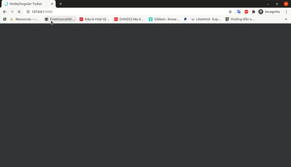

# Node-todos

Node-todos là 1 trang web to-dos CRUD đơn giản, lưu trữ trực tuyến sử dụng database MongoDB Cloud, server viết bằng NodeJS và hiển thị nhờ template engine ejs.

  - Database MongoDB Cloud
  - Server NodeJS
  - Hiển thị HTML nhờ template engine ejs



### Tech

Node-todos sử dụng 1 số open source projects và thư viện:

* [Visual Studio Code] - code editor
* [NodeJS] - server viết backend
* [Express] - node.js framework 
* [mongoose] - một công cụ mô hình hóa đối tượng MongoDB
* [ejs] - một template engine hiển thị HTML
* [morgan] - HTTP request logger middleware

### Installation

Node-todos cần thiết cài [Node.js](https://nodejs.org/) để chạy.

Cài đặt dependencies and devDependencies và chạy server.

```sh
$ cd Node-todos
$ npm install
$ npm start
```

Đối với môi trường...

```sh
$ npm install --production
$ NODE_ENV=production node app
```

Xác minh việc triển khai bằng cách điều hướng đến địa chỉ máy chủ của bạn trong trình duyệt ưa thích của bạn:

```sh
127.0.0.1:3000
```

### Todos

 - Write MORE Tests
 - Add Night Mode

### Authors

Nguyễn Quý Chí
nguyenquychi96@gmail.com 